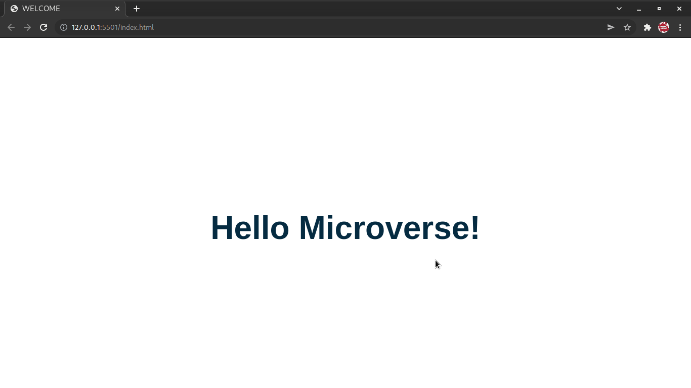

# Hello Microverse

> The purpose of this project is just to show how far I'am in using Github tools by creating a hello Microverse project with linters.

My first project with microverse

## Built With

- HTML & CSS
- Html & Css linters

## Live Demo

[Live Demo Link](https://goliviernation.github.io/hellomicroverse/)

## Getting Started

- clone the repository by running\
   `https://github.com/GOlivierNation/hellomicroverse.git`
- navigate to the folder\
   `cd hellomicroverse`

## Authors

👤 **Olivier**

- GitHub: [@githubhandle](https://github.com/GOlivierNation)
- Twitter: [@twitterhandle](https://twitter.com/Golivier_Nation)
- LinkedIn: [LinkedIn](https://www.linkedin.com/in/olivier-gasominali-866962108/)

## 🤝 Contributing

Contributions, issues, and feature requests are welcome!

## Show your support

Give a ⭐️ if you like this project!

## Acknowledgments

- Hat tip to anyone whose code was used
- Inspiration
- etc

## 📝 License

This project is [MIT](./MIT.md) licensed.
